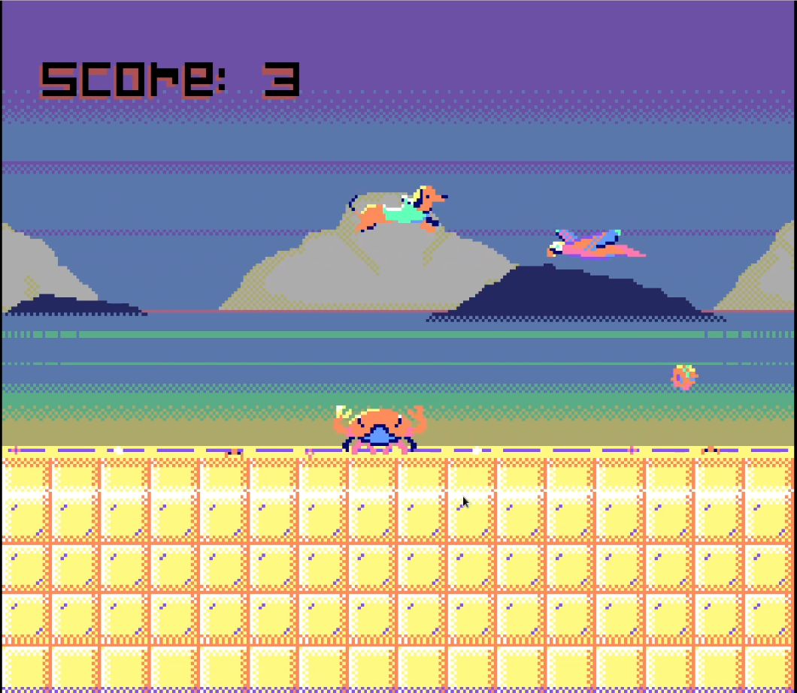
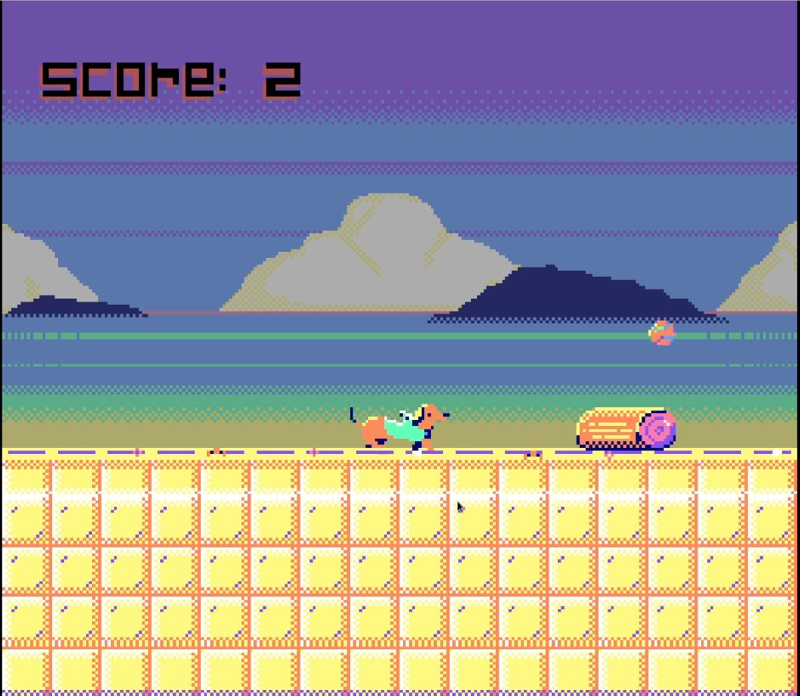

# Rocky by Gabriel Viera

Rocky is a endless runner game developed using C# and Godot Engine.

Play as Rocky Bananas, a dachshund wearing a frog hoodie that is trying to survive as long as he can dodging obstacles and collecting his favorite toy, orange balls.

# Game Background

This game was developed as a christmas gift Rocky's owner.

