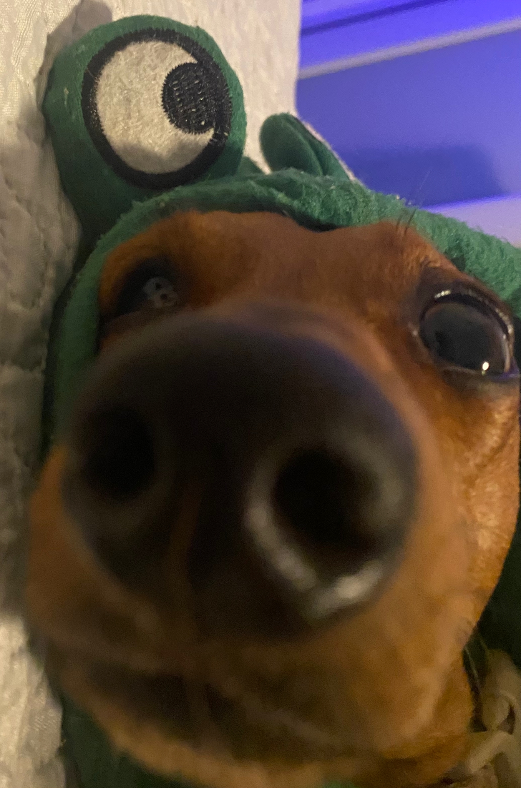

# Rocky

Rocky is a endless runner game developed using C# and Godot Engine.

Play as Rocky Bananas, a dachshund wearing a frog hoodie that is trying to survive as long as he can dodging obstacles and collecting his favorite toy, orange balls.

[Click here to play](https://g4vp.github.io/Games/Rocky/Rocky.html)

# Game Background

This game was developed as a christmas gift for Rocky's owner.

Game made by Gabriel Viera
Music made by Sebastián Minondo
